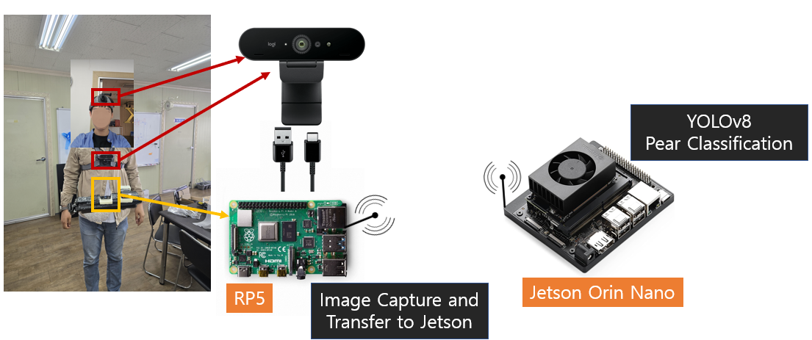
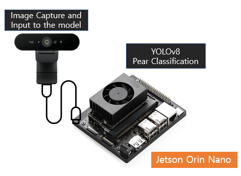

# Pear Detection System

## 0. Requirements

| **Item 1**                                                                                   | **Item 2** |
|----------------------------------------------------------------------------------------------|--------|
| Raspberry Pi with a camera to capture the image and send to Jetson Orin real-time (wireless) | Jetson Orin as a controller to execute Deep Learning model |
|                                                                  |  |
## I. Preparation
### 1. Jetson Orin 
- As a controller to execute Deep Learning model
- Required:
  - Jetpack 4.6 or later
  - Pytorch CUDA
  - OpenCV
  - ffmpeg
- This setup can reference from [here](https://github.com/synapsespectrum/Setting/tree/master/Jetson)

### 2. Raspberry Pi
- Within a camera to capture the image and send to Jetson Orin real-time
- Required:
  - Camera
  - `raspberry_requirements.txt`

### 3. Jetson Nano 
- Extending Edge Computing to detect the Pear (camera is attached to Jetson Nano)
- Required:
  - Camera
  - Jetpack 4.6 or later
  - Pytorch CUDA
  - OpenCV

## II. How to run
**Note: Setup all devices in the same network**
### 1. Raspberry Pi
#### 1.1. Setup
- Install `raspberry_requirements.txt`
- Connect the camera and Raspberry Pi
#### 1.2. Run
All the following commands are executed in the `src/app/Raspberry Pi` folder
- Run the Flask server
```bash
sh run.sh
```
 

### 2. Jetson Orin
#### 2.1. Setup
- Connect the Jetson Orin to the same network with Raspberry Pi
#### 2.2. Run
All the following commands are executed in the `src/app/Jetson Orin` folder
- Config the IP address of Raspberry Pi in `config.py`
- Install the requirements
```bash 
pip install -r requirements.txt
```
- Clone the Deep Learning model weights from [here](https://github.com/AISeedHub/pretrained-models/releases) and save it in `src/app/Jetson Orin/weights`

- Start the Vision Pear Detection System
```bash
sh run.sh
```

### Notes: There are 2 solutions to stream the video from Raspberry Pi to Jetson Orin:
- Using Flask Web Code: latency less than 1s
  - Change the resolution of the camera in "Raspberry Pi" to be lower to reduce the latency
- Using `ffmpeg`: latency ~1 sec


## III. Test Case
Check out the `test` folder for testing the system

## @Copyright (c) 2024, AISEED. All rights reserved.
