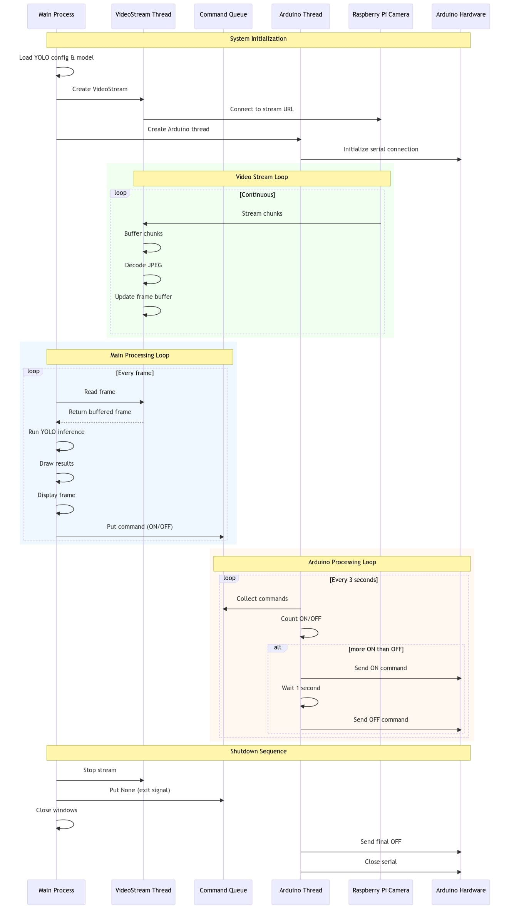

# Pear Detection System
PearVision is a real-time video processing and hardware control system designed for detecting Pear objects 
using a Deep Learning model. 
The system streams video from a specified URL, processes the frames to detect objects, 
and communicates with an **Arduino** device to perform actions based on the detection results.

## Features

- Real-time video streaming and processing (Item 1).
- Object detection using a Deep Learning model, [checkout here](https://github.com/AISeedHub/pear-detection).
- Communication with an Arduino device for hardware control.

## Requirements

| **Item 1**                                                                                   | **Item 2** |
|----------------------------------------------------------------------------------------------|--------|
| Raspberry Pi with a camera to capture the image and send to Jetson Orin real-time (wireless) | Jetson Orin as a controller to execute Deep Learning model |
|                                                                  |  |

## Technical Overview

|  |  |  |  |  |  |  |
|--------------------------------------------------|-----------------------------------------------|------------------------------------------------------|----------------------------------------------------------------------|--------------------------------------------------------------------------------------------|------------------------------------------------------------------------------|----------------------------------------------------------------------------------|
| **Multithreading**                               | **Video Streaming**                           | **[Deep Learning](https://github.com/AISeedHub/pear-detection)**                                    | **Edge Computing**                                                   | **Hardware Communication**                                                                 | **Network Configuration**                                                    | Flask                                                                            |


#### Pear Detection System Thread Timeline and Command Flow


## I. Getting Started
1. Clone the repository: git clone https://github.com/AISeedHub/PearVision.git
2. Install the required dependencies: pip install -r requirements.txt
3. Set up the Raspberry Pi and Jetson Orin devices according to the requirements
4. Execute the command `sh run.sh` in each device to start the system

## II. Usage
### 1. Raspberry Pi
#### 1.1. Setup
- Install `raspberry_requirements.txt`
- Connect the camera and Raspberry Pi
#### 1.2. Run
All the following commands are executed in the `src/app/Raspberry Pi` folder
- Run the Flask server
```bash
sh run.sh
```
 

### 2. Jetson Orin
#### 2.1. Setup
- Connect the Jetson Orin to the same network with Raspberry Pi
#### 2.2. Run
All the following commands are executed in the `src/app/Jetson Orin` folder
- Config the IP address of Raspberry Pi in `config.py`
- Install the requirements
```bash 
pip install -r requirements.txt
```
- Clone the Deep Learning model weights from [here](https://github.com/AISeedHub/pretrained-models/releases) and save it in `src/app/Jetson Orin/weights`

- Start the Vision Pear Detection System
```bash
sh run.sh
```

#### Notes: There are 2 solutions to stream the video from Raspberry Pi to Jetson Orin:
- Using Flask Web Code: latency less than 1s
  - Change the resolution of the camera in "Raspberry Pi" to be lower to reduce the latency
- Using `ffmpeg`: latency ~1 sec

### Troubleshooting
- Check the system logs for errors
- Verify the network connection between the Raspberry Pi and Jetson Orin devices
- Ensure the Arduino device is properly configured and connected


## III. Sequence diagram




## IV. Test Case
Check out the `test` folder for testing the system

## License
@Copyright (c) 2024, AISEED. All rights reserved.
